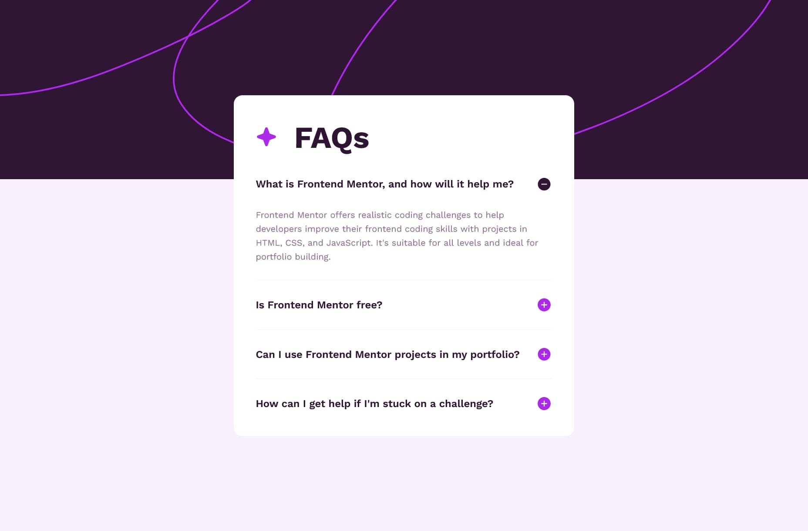

# Frontend Mentor - FAQ accordion solution

This is a solution to the [FAQ accordion challenge on Frontend Mentor](https://www.frontendmentor.io/challenges/faq-accordion-wyfFdeBwBz). Frontend Mentor challenges help you improve your coding skills by building realistic projects. 

## Table of contents

- [Overview](#overview)
  - [The challenge](#the-challenge)
  - [Screenshot](#screenshot)
  - [Links](#links)
- [My process](#my-process)
  - [Built with](#built-with)
  - [What I learned](#what-i-learned)

## Overview

### The challenge

Users should be able to:

- Hide/Show the answer to a question when the question is clicked
- Navigate the questions and hide/show answers using keyboard navigation alone
- View the optimal layout for the interface depending on their device's screen size
- See hover and focus states for all interactive elements on the page

### Screenshot




### Links

- Solution URL: [FAQ Accordion Solution](https://github.com/telsabate-hub/faq-accordion)
- Live Site URL: [FAQ Accordion Page](https://telsabate-hub.github.io/faq-accordion/)

## My process

### Built with

- Semantic HTML5 markup
- CSS custom properties
- Flexbox
- CSS Grid
- SASS/SCSS

### What I learned

I learned about using the details and summary elements.

```html
<details>
  <summary>
    What is Frontend Mentor, and how will it help me?
  </summary>
  <p>Frontend Mentor offers realistic coding challenges to help developers improve their 
    frontend coding skills with projects in HTML, CSS, and JavaScript. It's suitable for 
    all levels and ideal for portfolio building.</p>
</details>
```

